Secure your Web App easily. In today’s world, it is risky to have a website that isn’t properly secured from outside attacks. Luckily Azure offers some features that can help to protect your WebApps from outside attacks.
In this blog post, I will create a Virtual Network (VNet) and show you how you can secure your Webapp using a VNET and an Azure Application Gateway. The picture will show you what you can configure. But please enter your own information if you need other configurations.

We will start from scratch and I will not bother you with too many details. I do expect that you have some networking knowledge and a basic understanding of Azure.
I’ve made a picture of what we are trying to achieve in this blog post.


As you can see in this architecture diagram, is that we are gonna create a Virtual Network that blocks all access from the outside world. The services inside the network can only be reached through the Application Gateway or by using a VPN connection.

## Azure Virtual Network (VNet)

Open the [https](https://portal.azure.com/)[://portal](https://portal.azure.com/)[.](https://portal.azure.com/)[azure](https://portal.azure.com/)[.com](https://portal.azure.com/)

Now first we create a **new resource group** and select a region. Keep in mind that you select the same region in the upcoming steps.


After you have created a resource group we start directly by creating a new Virtual Network (VNet).


Now make sure that you select the resource group that just has been created. Also, make sure that you select the same region


Click on next

Now we need to configure a few subnets. Make sure that you are creating enough subnets.


On the next page we leave everything as default.

Now click on Review+Create.

Azure will now start creating the subnet. Grab yourself a cup of coffee ;-)

## Setup an Azure Web App

When Azure is finished setting up the Virtual Network we are gonna set up a WebApp service inside the VNET.

1. Go to the Azure Portal and start by creating a WebApp.
2. Now fill in the fields. Make sure that you select the right resource group and make sure that you select a premium service plan. For example P1V2.

**If you don’t use a premium service plan you could be missing essential features that are required for working with an App Service in a virtual network on Azure.**

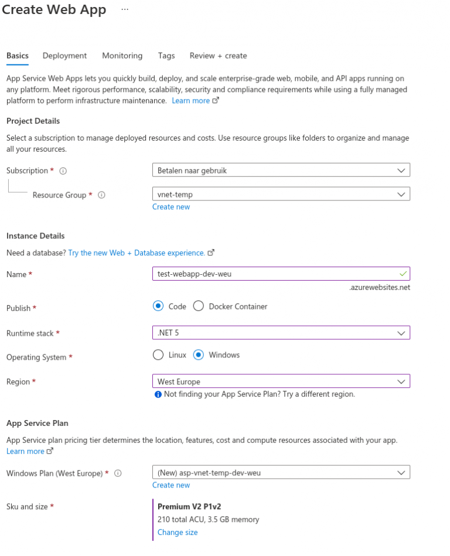

3. Now click on Review+Create.
4. Let Azure Create your web service. The next step is configuring the PrivateLinks and Private DNS Zone.

When the App is created by Azure we see that the Web App is accessible to the outside world without any form of security. . This is not what we want!
We would like to secure our Web App from outside attacks. That’s why we are gonna configure an Application Gateway that is gonna protect our app.


The first thing that we are gonna do is make sure that the Web App is not reachable anymore to the outside world. To do so, we are gonna add WebApp to our virtual network.
Open the WebApp in the Azure Portal and go to the networking options.
The following screen pops up.


Now click on the VNet integration options for the outbound traffic.
On the next screen, you have the option to select a VNet and a Subnet. (see picture below)

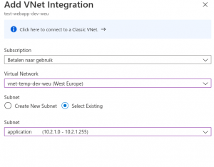

After selecting the right Subnet (Application) you click on the OK button below.

## two options to restrict access to your WebApp with a Azure Virtual Network

You can choose to implement a private endpoint or restrict access manually through the App service settings.

### private endpoint

Now we go back to the Networking options of the WebApp and we are gonna create a private endpoint. 
The reason we need a private endpoint is for other services (inside the virtual network) to connect to the WebApp. 
To create a private endpoint, we click on the private endpoint option in the networking options page of the WebApp.
Next click on the Add button

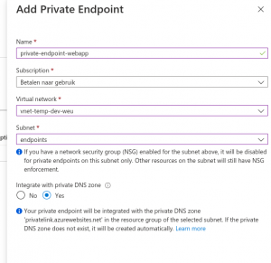


Make sure that you select a subnet in which endpoints can be added. Also, make sure that you have “**Integrate with private DNS zone**” enabled. This is essential if you want to link your app service to other services. Click on OK!

Behind the scenes, Azure will implement firewall rules that will prevent  access to the App service from the internet. You have to be inside the  virtual network to access the app service.
If you now try to access the website from the internet you will see:

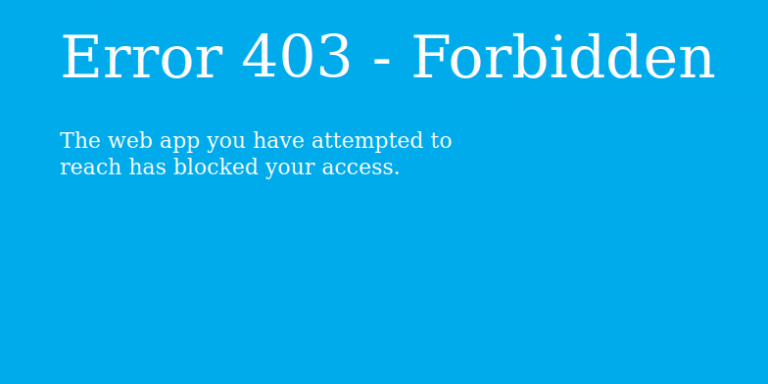

If we are inside the VNet and we do a DNS lookup of the App Service you can see what is going on.

```
Non-authoritative answer:
xxxxxxxxx.azurewebsites.net       canonical name = xxxxxxxxx.privatelink.azurewebsites.net.
Name:  xxxxxxxx.privatelink.azurewebsites.net
Address: 10.1.1.4
```

It seems that there is a new canonical name added to a private link  address of our App-service. After we have successfully added the private link we can also see 3 new items inside our resource group. A private-endpoint (we just created), a "private endpoint network interface" and a "Private DNS Zone". 

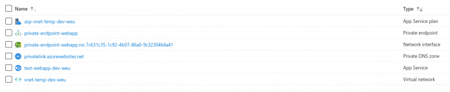

If we try to access the website from within the VNet and we use the original URL we can see the website. 

Important if you want to access the resources in the VNet, you need to have a VM  inside the VNet, that you can access. Or you can choose to set up **a VPN Gateway to the VNet.**

https://docs.microsoft.com/en-us/azure/vpn-gateway/openvpn-azure-ad-tenant

### access restrictions

The other way is to manual disable access to your app services by using  the Access restrictions. Once you have placed you app in a Azure VNet,  it doesn’t mean its automatically secured. So adding access restrictions can help you with that.
Make sure that you add the restrictions for both you app and the SCM!

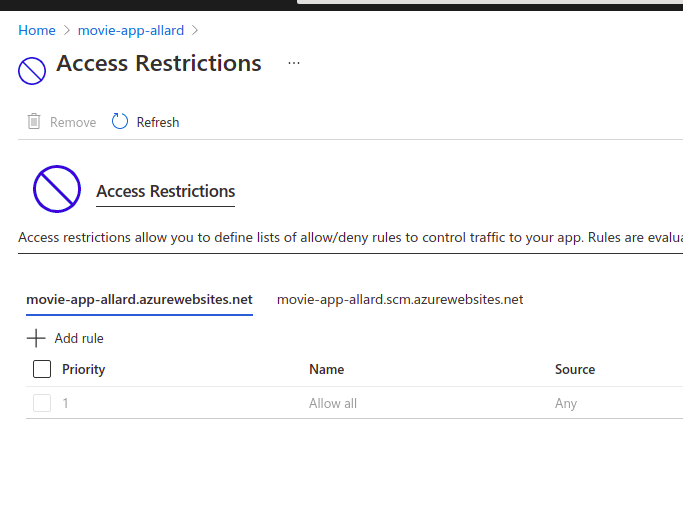

## Azure API management

Azure API management is a really powerful service that lets you connect  all kinds of services. Even old legacy services like WCF services and  ASMX services can be connected to the API management gateway. So if you  have many legacy services in your architecture, it’s no problem for API  management to absorb them and connect them to other systems or services. Of course, it’s better to get rid of these old services asap. But since we all have customers and not a lot of time, we all know that’s not  that easy to get rid of these old services 😉
[https://azure.microsoft.com/en-us/services/api-management/](https://azure.microsoft.com/en-us/services/api-management/#overview)

**CAUTION!! But before we continue I want to warn you. If you want to use  API management in a VNET you need to be aware of the fact, that you need to have a premium subscription on the API management gateway. If you  don’t get the premium TIER you are not able to use the API management in a VNET. The premium TIER is 2400 euro’s a month. So it’s quite  expensive!**

In this example, we are gonna use the development tier of the API management. 

1. Go to the Azure portal 
2. Click on create a resource and select API management
3. Now fill in the details, but make sure you select the same resource group as your VNET

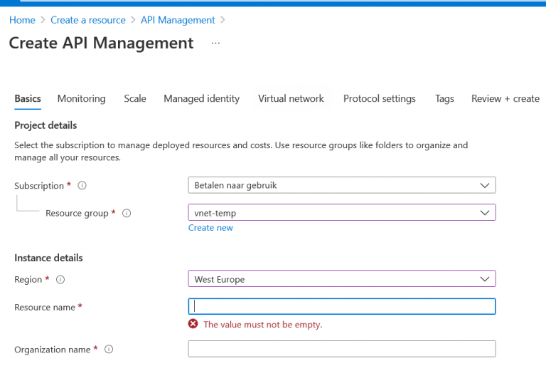


4. At the bottom you have the option to select a pricing tier. You can  easily select development, for your dev environment but make sure that  have an SLA when you got production. 

   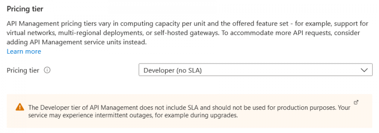

5. Click Next, and you have the option to also configure monitoring,  scaling and/or managed identities. For the sake of the length of this  tutorial, I will skip those. But the point that gets interesting is the  virtual network tab. Because how do you want to place your API  management. Only inside your VNET or also connected to the outside? In  this demo, we choose internal because we are gonna configure a gateway  that will be our main point of entry to our VNET. This API management  will only exist inside our VNET. So we choose internally. Select your  VNET and also select the right subnet. In our case the earlier created  management subnet.

   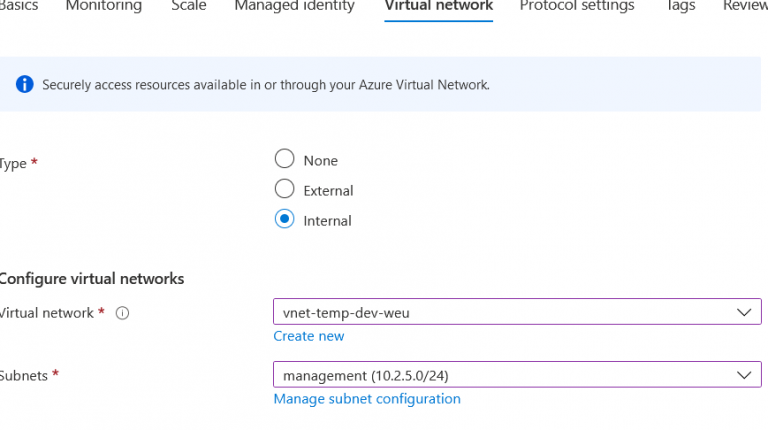

6. Now click on Review + Create. 
   Now creating the API could take some time (30-45 minutes). So get yourself a cup of coffee. 🙂

7. After some time the Azure API Management has been created. Probably you  will also receive an email in your mailbox telling you that Azure is  done creating your API management service.

## Azure Application Gateway

So everything is done, but still, our website isn’t reachable from  the outside. We locked it down with a private endpoint in a VNet. By  implementing this private endpoint, the Azure Firewall added rules that  will prevent access to our site from outside the VNet.

We are now gonna implement an Azure Gateway that will grant access  from the outside to the Azure VNet. Additionally, this Application  Gateway also adds additional security measures. Here you can find a full list:

https://docs.microsoft.com/en-us/azure/application-gateway/features

You can also take a look at Microsoft Azure Front Door, but this can’t connect to the VNet and stays outside the VNet.
https://azure.microsoft.com/nl-nl/services/frontdoor/

Do the following to create an Azure Application Gateway:

1. Navigate to the Azure Portal and create a new Azure Application Gateway

   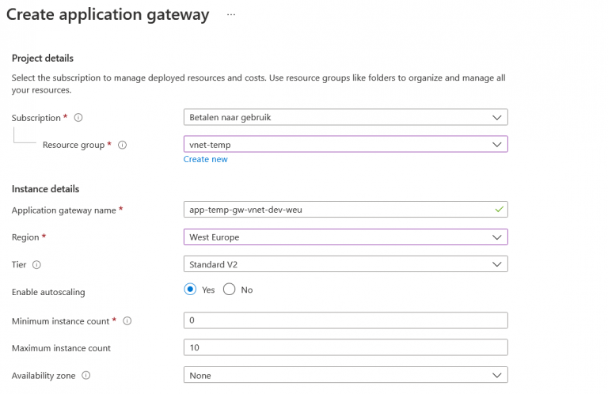

2. Click on Next. Now choose the public IP address on which you want to  expose your gateway. You can choose an existing public IP address or  create a new one. This will the main entry point of your architecture.

   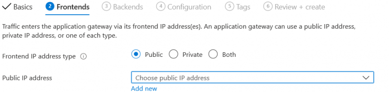

3. Click next

4. In the next page we are going to configure the  backend pool. These are the services to which your gateway is forwarding the traffic. You have 2 options here:

   The first option is to route all traffic to the Azure API-management service which routes it to your API services.
   But if you only have an Azure App service, web application, and no Azure  API to protect, then I would recommend the traffic directly from the  Application Gateway to your app service. 

5. Click on “Add a  backend pool” and set your target type to its desired destination (the  Azure App Service or possibly the API Management service)
   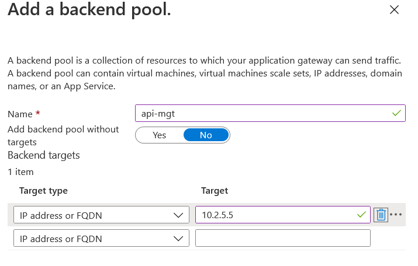

6. Now give the backend pool a name and make sure you set the target type  to the internal IP address of the Azure API-management service. Because  you want the traffic to be kept inside the Virtual Network. 

7. Now click on “Add”

8. In the next screen we need to add a routing rule in order to link our Front-end configuration with our Backend configuration

   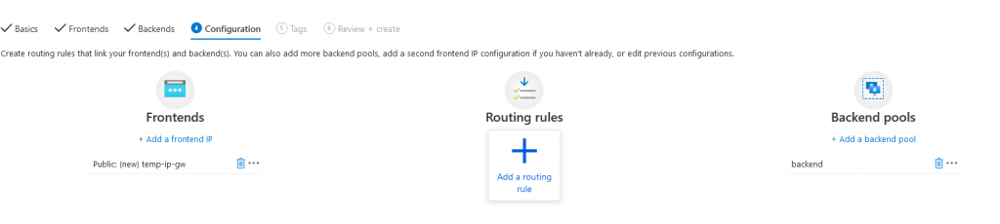

9. Now add a new listener for only HTTP
   This is the configuration  that is required if you want to fetch requests for HTTP, HTTPS or both.  You can for example choose to intercept HTTP requests and redirect them  automatically to HTTPS. But in that case, you need 2 listeners. 
   For now, we only configure HTTP. So that means we only catch HTTP traffic with our Gateway.

   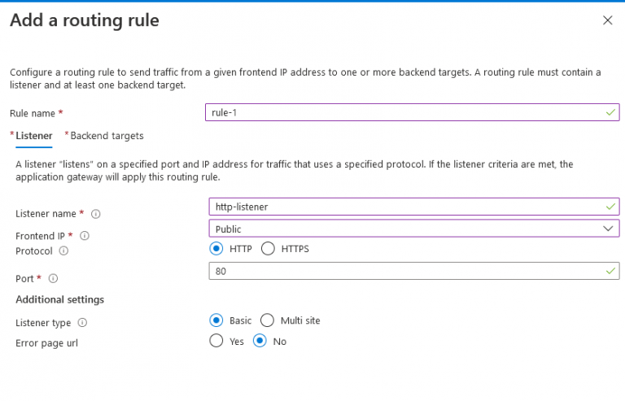

   10. Now click on the Backend targets tab
   11. Select again the backend as your backend target
   12. And if you haven’t configured an HTTP setting, you can click on “Add new”


13. To confirm the setting and the routing rule you can click on add.
14. The last thing to do is review and create the gateway. This will take about 15-20 minutes.


Thats it. Now you have the basics for setting up your Azure resource in a VNet and behind an Azure Application Gateway.

