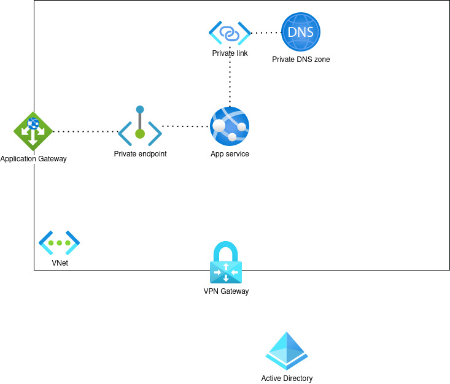
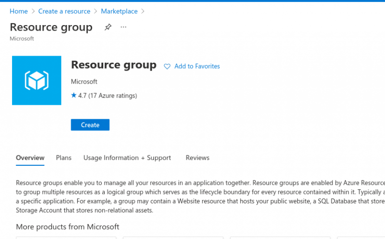
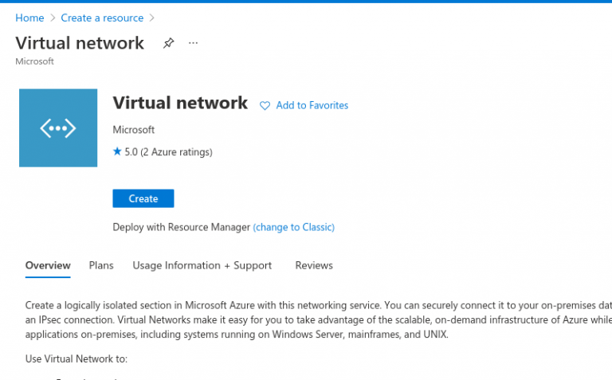
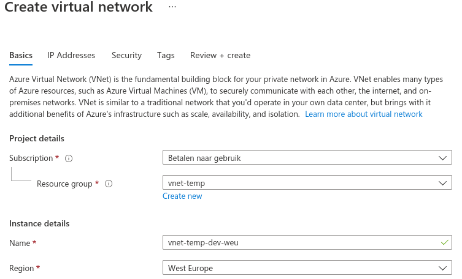
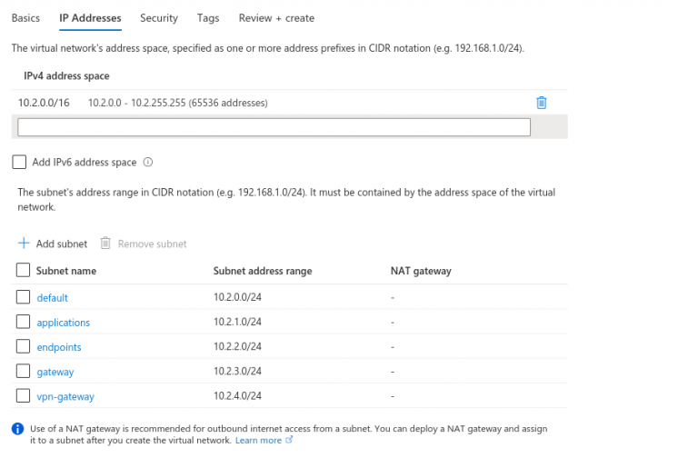
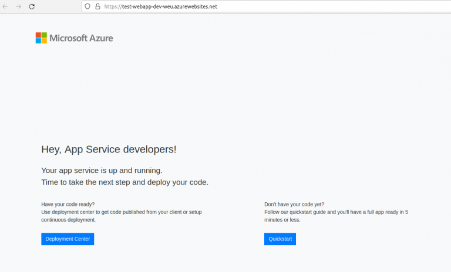
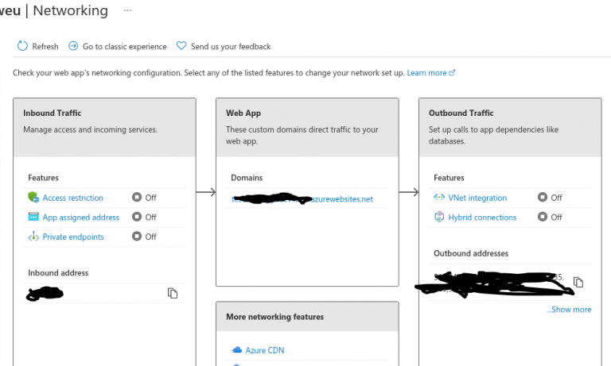

Secure your Web App easily. In today’s world, it is risky to have a website that isn’t properly secured from outside attacks. Luckily Azure offers some features that can help to protect your WebApps from outside attacks.
In this blog post, I will create a Virtual Network (VNet) and show you how you can secure your Webapp using a VNET and an Azure Application Gateway. The picture will show you what you can configure. But please enter your own information if you need other configurations.

We will start from scratch and I will not bother you with too many details. I do expect that you have some networking knowledge and a basic understanding of Azure.
I’ve made a picture of what we are trying to achieve in this blog post.

As you can see in this architecture diagram, is that we are gonna create a Virtual Network that blocks all access from the outside world. The services inside the network can only be reached through the Application Gateway or by using a VPN connection.

## Azure Virtual Network (VNet)

Open the [https](https://portal.azure.com/)[://portal](https://portal.azure.com/)[.](https://portal.azure.com/)[azure](https://portal.azure.com/)[.com](https://portal.azure.com/)

Now first we create a **new resource group** and select a region. Keep in mind that you select the same region in the upcoming steps.

After you have created a resource group we start directly by creating a new Virtual Network (VNet).

Now make sure that you select the resource group that just has been created. Also, make sure that you select the same region

Click on next

Now we need to configure a few subnets. Make sure that you are creating enough subnets.

On the next page we leave everything as default.

Now click on Review+Create.

Azure will now start creating the subnet. Grab yourself a cup of coffee ;-)

## Setup an Azure Web App

When Azure is finished setting up the Virtual Network we are gonna set up a WebApp service inside the VNET.

1. Go to the Azure Portal and start by creating a WebApp.
2. Now fill in the fields. Make sure that you select the right resource group and make sure that you select a premium service plan. For example P1V2.

**If you don’t use a premium service plan you could be missing essential features that are required for working with an App Service in a virtual network on Azure.**

3. Now click on Review+Create.
4. Let Azure Create your web service. The next step is configuring the PrivateLinks and Private DNS Zone.

When the App is created by Azure we see that the Web App is accessible to the outside world without any form of security. . This is not what we want!
We would like to secure our Web App from outside attacks. That’s why we are gonna configure an Application Gateway that is gonna protect our app.

The first thing that we are gonna do is make sure that the Web App is not reachable anymore to the outside world. To do so, we are gonna add WebApp to our virtual network.
Open the WebApp in the Azure Portal and go to the networking options.
The following screen pops up.

Now click on the VNet integration options for the outbound traffic.
On the next screen, you have the option to select a VNet and a Subnet. (see picture below)
